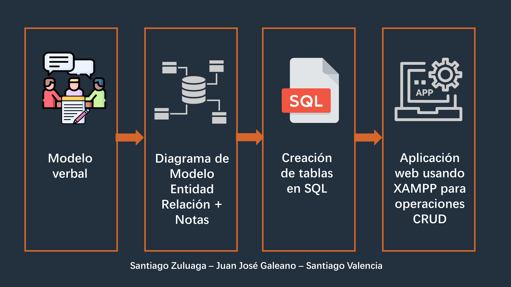
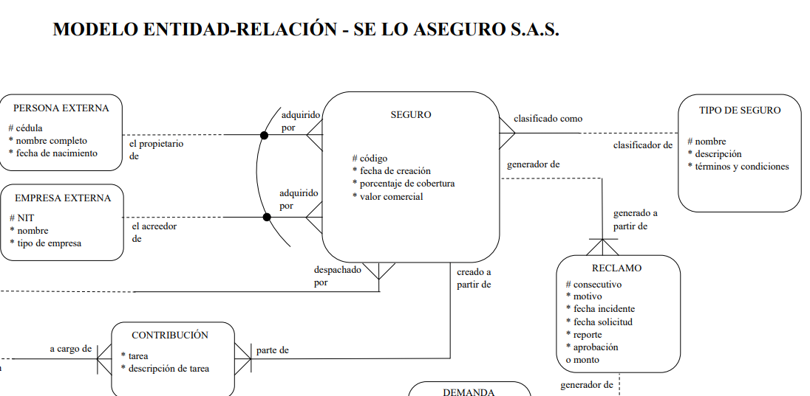

# Modelación de base de datos para aseguradora

## Modelo verbal

Se establece un [modelo verbal](modelo-verbal.pdf) que servirá como lógica de negocio. A partir del modelo verbal se construye el diagrama ER que satisfaga los hechos del modelo verbal. Así comienza el modelo verbal:

> Una compañía se dedica a vender seguros de autos; para lo cual necesita una base de datos con el objetivo de registrar todo tipo de características y operaciones externas e internas relacionadas con la venta de seguros, de la siguiente manera:  La empresa tiene 3 tipos de empleados que pueden ser: analistas, vendedores o abogados; se debe tener en cuenta que cada empleado solo puede ejercer su cargo, además la empresa no cuenta con empleados rasos... [continua]

## Modelo Entidad-Relación

Construcción del [diagrama para el modelo de entidad relación](diagrama-modeloEntidadRelacion.pdf). Adicionalmente, se incluye una serie de [Notas al modelo](notas-modelo.pdf) como insumo a la hora de realizar la implementación de la base de datos. **Se muestra una parte del modelo ER**. [(veálo completo aquí)](diagrama-modeloEntidadRelacion.pdf)

## Creación de tablas en SQL

[Instrucciones para la creación de las tablas](creacion-tablas-SQL.pdf) del modelo en SQL.

## Aplicación web - CRUD

Se implementa una [aplicación web](./aseguradora) que interactúe con la base de datos para realizar operaciones **CRUD (create, read, update, delete).**

Si desea ver una demo de la aplicación web, siga la siguientes instrucciones:

1. Instale XAMPP (cross-platform, Apache, MySQL, PHP and Perl)
2. Guarde carpeta aseguradora en xampp\htdocs
3. Importe el archivo [aseguradora.sql](.aseguradora/asegurado.sql) en phpmyadmin
4. Ingrese a http://localhost/aseguradora/inicio.php 
5. Empiece a realizar operaciones CRUD usando la aplicación web y vea como interactúa con la base de datos!
